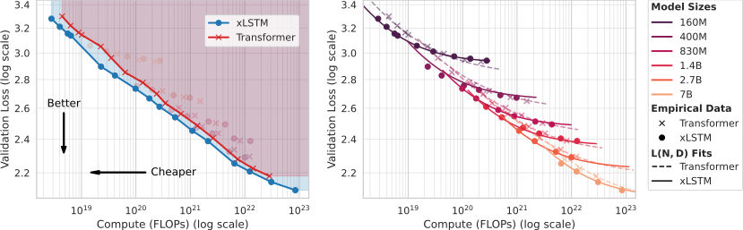

# xLSTM Scaling Laws: Competitive Performance with Linear Time-Complexity

 

>Paper: [Arxiv]()
>
>Authors: Maximilian Beck, Kajetan Schweighofer, Sebastian Böck, Sebastian Lehner, Sepp Hochreiter

## About

This repository contains the code and data for our research on xLSTM scaling laws. We investigate the scaling behavior and computational characteristics of xLSTM architectures compared to dense multi-head Transformers across varying model sizes, training datasets, and context lengths.

### Key Findings

- **Training Efficiency**: xLSTM models demonstrate competitive performance across nearly 5 orders of magnitude of compute, with favorable loss-to-FLOP ratios compared to Transformers
- **Compute-Optimal Models**: Analysis reveals that optimal xLSTM models tend to be larger than optimal Transformer models for a given compute budget, with model size characteristics that remain consistent across different context lengths
- **Inference Characteristics**: xLSTM exhibits reduced time-to-first-token (TTFT) and context-independent step times at 16k sequence length, with scaling advantages that increase with context length
- **Scaling Behavior**: xLSTM maintains power-law scaling relationships even in high token-to-parameter ratio training regimes

Our study encompasses model sizes from 80M to 7B parameters, training datasets from 2B to 2T tokens, and examines both training scaling laws and inference-time properties. The results provide insights into xLSTM as an alternative architecture for applications involving long context processing.

## Repository Overview

This repository is organized into the following main components:

```
xlstm_scaling_laws/
├── data/                    # Run data for our Dataset of Training runs
├── data_lnd_fits/           # Results of our parametric L(N,D) fits 
├── notebooks/               # Jupyter notebooks for analysis and visualization
├── scripts/                 # Training and evaluation scripts
├── xlstm_scaling_laws/      # Main library for the scaling law analysis
├── requirements.txt         # Python dependencies
└── README.md                # This file
```

## Dataset of Training Runs

We provide all experiment logs and run data in several pickle files in the `data/` folder.

In `xlstm_scaling_laws/common/` we provide the functions to load and access the raw training log data extracted from wandb.

In `xlstm_scaling_laws/load_data` we provide functions to extract the preprocessed data for our scaling law analyses. 

Please have a look at the notebooks in `notebooks/paper_plots/` for examples on how to access and visualize the data.

## Notebooks

The `notebooks/` directory contains interactive Jupyter notebooks organized into:
- `paper_plots/` - Notebooks reproducing all figures from our paper
- `experiment_setup/` - Notebooks for setting up our IsoFLOP experiments
- `flop_calculations/` - Some FLOP and Arithmetic Intensity calculations
- `inference_time/` - Notebooks for fitting our inference time models

## Scripts

The `scripts/` directory contains the scripts for running the parametric L(N,D) fits on our Dataset of Training runs.

## Citation

Please cite our papers if you use this codebase, or otherwise find our work valuable:

```
@article{beck:25xlstmscaling,
  title        = {{xLSTM Scaling Laws}: Competitive Performance with Linear Time-Complexity},
  author       = {Maximilian Beck and Kajetan Schweighofer and Sebastian Böck and Sebastian Lehner and Sepp Hochreiter},
  year         = {2025},
  volume       = {},
  journal      = {arXiv},
  primaryclass = {cs.LG},
  url          = {}
}
```